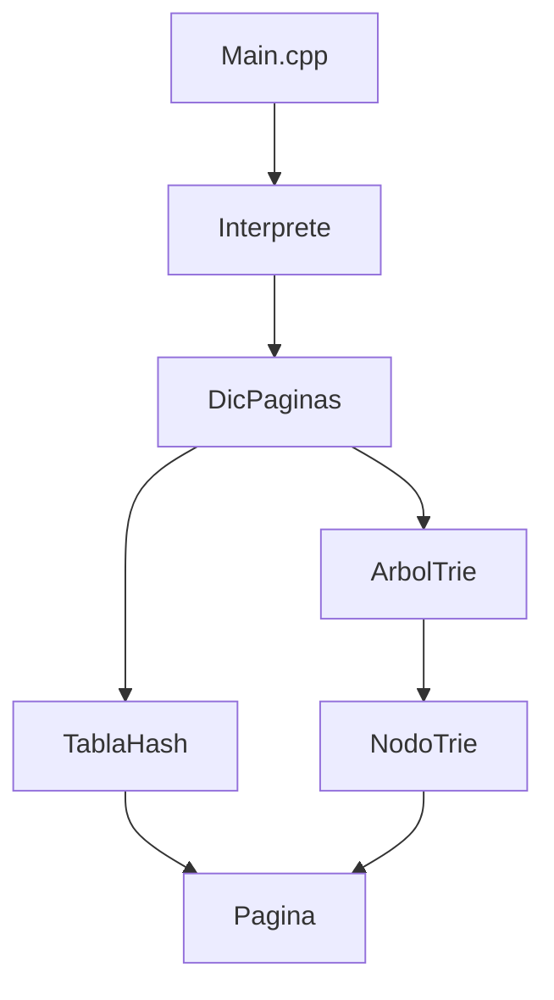

# Buscador Web


Herramienta CLI que actúa como un buscador web que indexa páginas por URL y por palabra clave. Permite insertar páginas, buscar por URL, por palabra y autocompletar, todo a través de la entrada estándar.

## Datos académicos

- **Asignatura**: Algoritmos y Estructuras de Datos I.
- **Universidad**: Universidad de Murcia (UMU).
- **Titulación**: Grado en Ingeniería Informática.
- **Curso**: 2024 / 2025.

| Integrantes | GitHub |
|-------------|--------|
| Ibrahim Cherif Barry | [ibrac](https://github.com/ibrac) |
| Carlos Ramírez Riquelme | — |

## Estado del proyecto

- ✅ Funcionan: `i` (insertar), `u` (buscar por URL), `b` (buscar por palabra), `s` (salir).
- ⚠️ **Sin implementar**: `a` (AND), `o` (OR) y `p` (autocompletar) están definidos en el intérprete y leen/normalizan la entrada correctamente, pero no realizan ningún filtrado ni búsqueda; siempre devuelven `Total: 0 resultados`.

## Estructura del proyecto

```tree
buscador-web/
├── proyecto/                       # Código fuente del buscador
│   ├── Arboltrie.cpp/.h            # Índice palabra → lista de páginas
│   ├── DicPaginas.cpp/.h           # Fachada: coordina TablaHash + ArbolTrie
│   ├── Interprete.cpp/.h           # Normaliza texto e interpreta comandos
│   ├── Main.cpp                    # Bucle principal: lee comandos de stdin
│   ├── Makefile                    # Reglas de compilación y limpieza
│   ├── Nodotrie.cpp/.h             # Nodo del árbol Trie
│   ├── Pagina.cpp/.h               # Modelo: relevancia, url, titulo
│   └── TablaHash.cpp/.h            # Páginas por URL (hash con encadenamiento)
├── .gitignore                      # Archivos y directorios ignorados por git
└── README.md                       # Documentación principal del proyecto
```

## Diagrama de módulos



## Arquitectura

- **`TablaHash`**: hash con encadenamiento sobre `list<Pagina>`. Guarda cada página usando su URL como clave, ofreciendo búsqueda en O(1) esperado.
- **`ArbolTrie` + `NodoTrie`**: cada palabra se inserta como un recorrido en el trie, y en cada nodo hoja se almacena una `list<Pagina*>` con las páginas que contienen esa palabra.
- **`DicPaginas`**: clase fachada que combina la tabla hash (gestión de páginas por URL) y el trie (índice invertido por palabra).
- **`Pagina`**: almacena `relevancia`, `url` y `titulo`.
- **`Interprete`**: normaliza la entrada convirtiendo a minúsculas y resolviendo acentos/diéresis en UTF-8 (p. ej. `á` → `a`, `ñ` se conserva), y ejecuta el comando solicitado.

### Decisiones de diseño

- **Encadenamiento sobre tabla cerrada**: se optó por dispersión abierta (listas enlazadas por índice) para no tener que lidiar con redispersión cuando la tabla se llena; con encadenamiento, una colisión simplemente añade un nodo más a la lista correspondiente.
- **Tamaño de tabla `B = 1009`**: es un número primo, lo que ayuda a distribuir mejor los índices resultantes de `getHash()` y reduce la probabilidad de colisiones frente a un tamaño compuesto. La tabla es de tamaño fijo (no se redimensiona en tiempo de ejecución).
- **Función de dispersión — suma de cuadrados**: se probaron tres variantes antes de llegar a la actual (`suma += caracter * caracter`). Sumar el valor ASCII de cada carácter multiplicado por una constante (1000, luego 31) generaba demasiadas colisiones y listas largas, lo que penalizaba el tiempo pese a tener menor complejidad aritmética. La suma de cuadrados, aunque más costosa por carácter, dispersa mejor las URLs y reduce el recorrido de las listas enlazadas.
- **Trie en vez de AVL o árbol B**: un AVL no aporta ninguna ventaja aquí porque no hay necesidad de balanceo (el patrón de acceso es por prefijo, no por comparación de claves), y añadiría coste de rebalanceo sin beneficio. Un árbol B tampoco aplica porque no hay almacenamiento secundario (disco) que justifique nodos de alto fan-out. Además, el Trie ofrece ventajas propias:
  - **Complejidad O(L) determinista**: buscar o insertar cuesta O(longitud de la palabra) con comparaciones carácter a carácter, independientemente del número de palabras `n`; un AVL pagaría O(log n) comparaciones de cadenas enteras por operación.
  - **Compartición de prefijos**: las palabras con raíces comunes (muy frecuentes en español: `corre`, `correr`, `corredor`, `correo`) comparten nodos, ahorrando memoria frente a guardar cada clave completa por separado.
  - **Sin rebalanceo**: el Trie no realiza ninguna rotación ni operación de reequilibrio tras las inserciones.
  - **Recorrido ordenado natural**: permite enumerar las palabras en orden lexicográfico sin ordenar, y facilita la búsqueda por prefijo que requiere el autocompletado (`p`).

## Requisitos

- Compilador `g++` (GCC en Linux, MinGW en Windows).
- `make` para la compilación automática.

## Compilación y ejecución

```bash
cd proyecto
make
```

`make` genera el ejecutable:
- **Linux**: `a.out`
- **Windows (MinGW)**: `a.exe`

El programa lee comandos de la entrada estándar. Se puede alimentar desde un archivo o escribir a mano:

```bash
# Linux
./a.out < entrada.txt

# Windows
./a.exe < entrada.txt
```

### Limpieza

```bash
make clean
```

Elimina los archivos objeto (`.o`) y los binarios (`a.out`/`a.exe`). Los archivos fuente (`.cpp`, `.h`) y los de datos (`.in`, `.out`) se conservan.

## Comandos

| Comando      | Acción                                                            |
|--------------|-------------------------------------------------------------------|
| `i`          | Insertar una página y sus palabras de contenido.                  |
| `u <url>`    | Buscar una página por URL.                                        |
| `b <palabra>`| Buscar páginas que contengan una palabra.                         |
| `a <palabras...>` | Búsqueda AND (todas las palabras).                           |
| `o <palabras...>` | Búsqueda OR (al menos una palabra).                          |
| `p <prefijo>` | Autocompletar palabras a partir de un prefijo.                   |
| `s`          | Salir del programa.                                               |

### Insertar (`i`)

Formato de entrada:

```
i
<relevancia>
<url>
<titulo>
<palabra1>
<palabra2>
findepagina
```

- `relevancia`: número entero.
- `url`: línea (sin espacios).
- `titulo`: línea.
- Palabras: una por línea, terminadas con `findepagina`.

### Buscar por URL (`u`)

Entrada:
```
u https://es.wikipedia.org/wiki/Perro
```

Salida (si la página existe):
```
u https://es.wikipedia.org/wiki/Perro
1. https://es.wikipedia.org/wiki/Perro, Perro - Wikipedia, Rel. 3
Total: 1 resultados
```

Si la URL no está indexada:
```
u https://www.ejemplo.com/inexistente
Total: 0 resultados
```

### Buscar por palabra (`b`)

Entrada:
```
b perro
```

Salida (si hay páginas que la contienen):
```
b perro
1. https://es.wikipedia.org/wiki/Perro, Perro - Wikipedia, Rel. 3
Total: 1 resultados
```

Si no hay resultados:
```
b gato
Total: 0 resultados
```

### Búsqueda AND (`a`)

Entrada:
```
a perro gato
```

Salida:
```
a perro gato
Total: 0 resultados
```

### Búsqueda OR (`o`)

Entrada:
```
o perro gato
```

Salida:
```
o perro gato
Total: 0 resultados
```

### Autocompletar (`p`)

Entrada:
```
p per
```

Salida:
```
p per
Total: 0 resultados
```

### Salir (`s`)

Entrada:
```
s
```

Salida:
```
Saliendo...
```

## Ejemplo completo de `entrada.txt`

```
i
3
https://es.wikipedia.org/wiki/Perro
Perro - Wikipedia
perro
mamifero
animal
domestico
findepagina
u https://es.wikipedia.org/wiki/Perro
b perro
s
```

### Salida esperada

```
1. https://es.wikipedia.org/wiki/Perro, Perro - Wikipedia, Rel. 3
4 palabras
u https://es.wikipedia.org/wiki/Perro
1. https://es.wikipedia.org/wiki/Perro, Perro - Wikipedia, Rel. 3
Total: 1 resultados
b perro
1. https://es.wikipedia.org/wiki/Perro, Perro - Wikipedia, Rel. 3
Total: 1 resultados
Saliendo...
```
